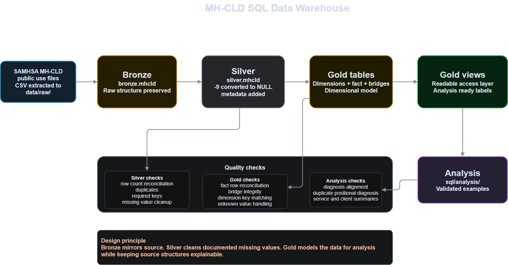

### Building a Data Warehouse using SQL

#### Objective

Develop a SQL focused data warehouse using SAMHSA MH-CLD data.The medallion architecture is used to transform raw behavioral health records into structured datasets suitable for analytical use.

#### Specifications

- **Data Source**: This project uses SAMHSA Mental Health Client Level Data (MH-CLD) public use file. The raw ZIP file is not included in this repository. To run the project locally, download the MH-CLD 2024 delimited public-use file from SAMHSA and extract the CSV files into data/raw/.
Official data files page: [SAMHSA MH-CLD Data Files](https://www.samhsa.gov/data/data-we-collect/mh-cld-mental-health-client-level-data/datafiles)
Direct download: [MH-CLD-2024 dataset](https://www.samhsa.gov/data/system/files/media-puf-file/MH-CLD-2024-DS0001-bndl-data-csv_v1.zip)
- **Data Quality**: Handle documented missing values, validate record counts, identify duplicates, and verify relationships between warehouse tables.
- **Integration**: Transform source data through [Bronze](sql/bronze/00_build_bronze.sql), [Silver](sql/silver/00_build_silver.sql), and [Gold](sql/gold/00_build_gold.sql) layers within DuckDB.
- **Data Modeling**: Build fact and dimension tables supporting diagnoses, behavioral health services, client characteristics, and geography.
- **Documentation**: Provide SQL scripts, [setup instructions](getting_started.md), quality checks, and clear project documentation.

---

### Analytics & Reporting 

#### Objective

Develop SQL based analytics using the Gold layer to explore patterns within behavioral health services and client characteristics.

Analysis can provide insight into:

- **Mental Health Diagnosis Patterns**
- **Service Utilization**
- **Clinical Complexity**
- **Geographic Variation**
- **Client Functional and Social Characteristics**
- **Mental Health and Substance Use Service Patterns**

The warehouse is designed so additional analytical questions can be added without modifying the raw source layer.
